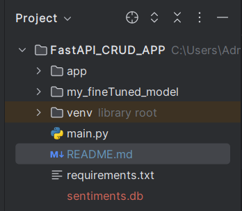
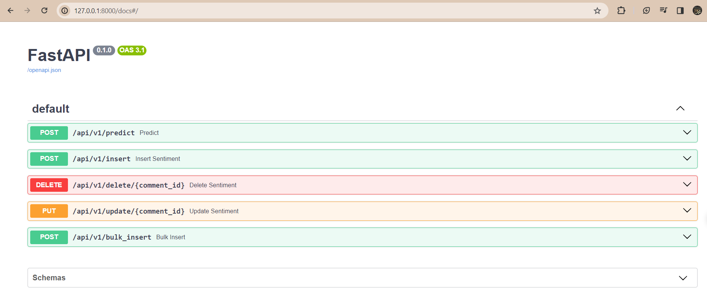

# Instructions to run th APP

## 1. Install Requirements
``pip install -r requirements.txt``

## 2. Setup Model / LLM
- Place your LLM in folder `my_fineTuned_model`
- Place it in root folder 

## 3. Start APP
- Run the main.py file
- Search ``127.0.0.1:8000/docs`` in browser

Your App is up and Running

